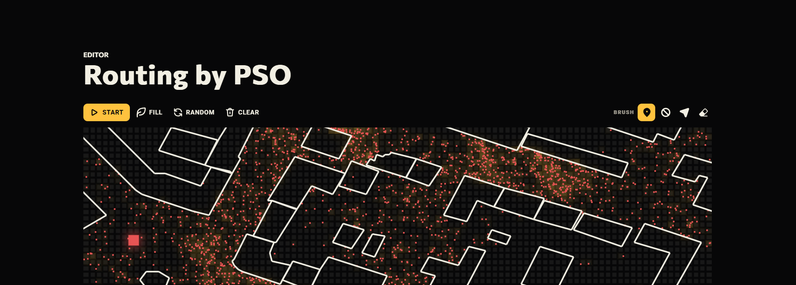

# Маршрутизация с помощью PSO

Этот проект демонстрирует, как метод роя частиц (PSO) может использоваться для решения задач маршрутизации. Изначально создан как университетский проект, он включает интерактивный интерфейс для построения и решения задач поиска пути.

<a href="https://justkesha.github.io/routing-by-pso/ru/editor/?w=20:20:40:20,40:20:40:0,0:40:40:40,60:20:80:20,80:40:100:40,100:40:100:0,80:60:120:60,120:40:120:60,20:60:20:80,40:80:80:80,120:20:140:20,160:60:160:80,160:80:200:80,180:60:180:40,160:20:160:0,180:80:180:100,200:80:200:20,200:60:240:60,220:80:240:80,240:60:240:80,260:40:260:100,260:80:280:80,280:60:300:60,280:20:280:40,220:40:240:40,100:60:100:100,120:40:180:40,40:20:60:20,20:60:60:60,60:60:60:80,40:40:40:60,60:40:60:20,260:40:280:40,180:20:220:20,240:20:260:20,240:40:240:0,140:80:140:20,120:80:140:80&m=preview"></a>

## Возможности

- Интерактивный редактор маршрутов и узлов
- Загрузка реальных карт через OpenStreetMap
- Визуализация частиц в реальном времени
- Возможность делиться результатами симуляции
- Поддержка английского и русского языков
- Настройка темы оформления

## Как пользоваться

1. Перейдите по ссылке: https://justkesha.github.io/routing-by-pso/
2. Используйте редактор для размещения узлов и установки препятствий
3. Настройте параметры симуляции
4. Запустите симуляцию PSO для поиска оптимальных маршрутов
5. Сохраните или поделитесь результатами

## Технические детали

- Реализовано на чистом JavaScript (ES6 классы)
- Пользовательский рендеринг на основе событий
- Работает во всех современных браузерах

## Лицензия

Проект распространяется по лицензии MIT. Подробнее см. файл LICENSE.
