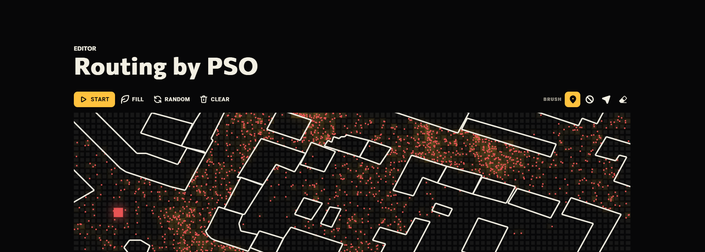

# 🕊️ Routing by PSO ([Перевести?](PROCHTI.md))

This project visualizes the power of [Particle Swarm Optimization (PSO)](https://en.wikipedia.org/wiki/Particle_swarm_optimization) for solving complex routing problems. Developed a while ago as a university side project, it provides an interactive way to understand how [swarm intelligence](https://en.wikipedia.org/wiki/Swarm_intelligence) can be used for pathfinding and route optimization.

The website is avalible at [justkesha.github.io/routing-by-pso](https://justkesha.github.io/routing-by-pso/), thanks to [GitHub pages](https://pages.github.com).

## Overview

Example scenario from the [website](https://justkesha.github.io/routing-by-pso/) (no obstacles, two targets, connections view preset):

### Features:

- **Powerful Editor**: Customize obstacles, particles and targets in real-time
- **OpenStreetMap Integration**: Load real-world maps to solve practical routing problems
- **Dynamic Visualization**: Watch particles move and adapt as they search for optimal routes
- **Sharing Features**: Easily share your routes and simulations with others using links or codes
- **Multilingual Support**: Available in both English and Russian
- **Many Settings**: Lots settings and presets for you to play around with
- **Themes**: Multiple visual themes to customize your experience

### How to Use:

1. Go to [justkesha.github.io/routing-by-pso](https://justkesha.github.io/routing-by-pso/) and open the editor tab
2. Use brushes on the top right to define your routing problem
3. Adjust display and simulation parameters to your liking
4. Run the simulation to see PSO in action
5. Share your results with the built-in link generator

## Implementation

This project is based on my prior developed JS module for PSO routing, you can read more about it in [this repository](https://github.com/JustKesha/js-pso-routing). 
Website is made using vanilla HTML, CSS & JS. Animation is done using the canvas element.

Animation from the [main module repository](https://github.com/JustKesha/js-pso-routing):

## About PSO

Wiki animation - A particle swarm searching for the global minimum of a function:

[Particle Swarm Optimization](https://en.wikipedia.org/wiki/Particle_swarm_optimization) is a computational method that optimizes a problem by iteratively trying to improve a candidate solution with regard to a given measure of quality. It solves a problem by having a population of candidate solutions (particles) and moving these particles around in the search-space according to simple mathematical formulae.

## License

This project is licensed under the MIT License - see the [LICENSE](LICENSE) file for details.
