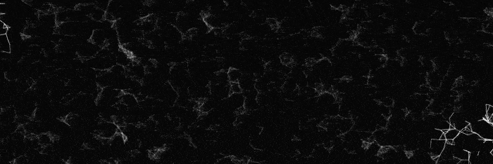

# 🔄 Routing by PSO

  

  

## 📋 Overview

This project visualizes the power of **Particle Swarm Optimization (PSO)** for solving complex routing problems. Originally developed as a university project, it provides an interactive way to understand how swarm intelligence can be used for pathfinding and route optimization.

## ✨ Features

- 🛠️ **Interactive Editor**: Customize routes, nodes, and obstacles in real-time
- 🌍 **OpenStreetMap Integration**: Load real-world maps to solve practical routing problems
- 🔄 **Dynamic Visualization**: Watch particles move and adapt as they search for optimal routes
- 🔗 **Sharing Capabilities**: Easily share your routes and simulations with others
- 🌐 **Multilingual Support**: Available in both English and Russian
- 🎨 **Theme Options**: Multiple visual themes to customize your experience

## 🚀 Getting Started

Simply visit [https://justkesha.github.io/routing-by-pso/](https://justkesha.github.io/routing-by-pso/) to start experimenting with the application. No installation required!

### How to Use:

1. Open the editor by clicking on the "Editor" link
2. Create nodes and connections to define your routing problem
3. Adjust parameters like particle count, speed, and intelligence
4. Run the simulation to see PSO in action
5. Share your results with the built-in link generator

## 💻 Implementation

The project uses vanilla JavaScript with classes to implement the PSO algorithm:

- `SwarmEntity` - Represents a single particle in the swarm
- Custom rendering for optimal visualization
- Event-based architecture for real-time interaction

## 🔍 About PSO

Particle Swarm Optimization is a computational method that optimizes a problem by iteratively trying to improve a candidate solution with regard to a given measure of quality. It solves a problem by having a population of candidate solutions (particles) and moving these particles around in the search-space according to simple mathematical formulae.

## 📱 Compatibility

Works in all modern browsers supporting HTML5 Canvas.

## 📄 License

This project is licensed under the MIT License - see the [LICENSE](LICENSE) file for details.
